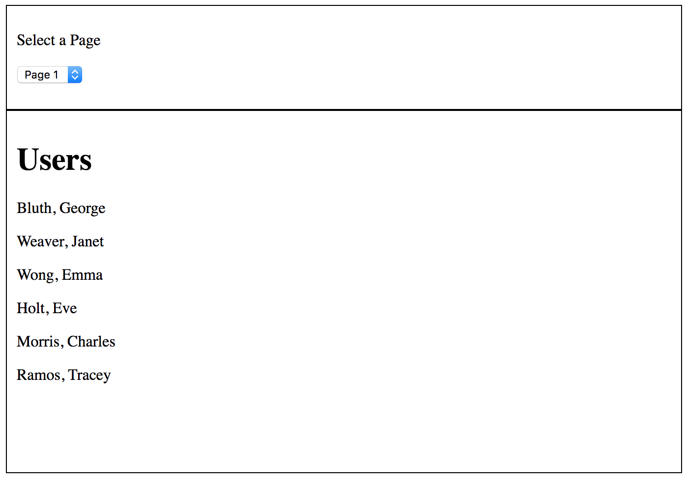
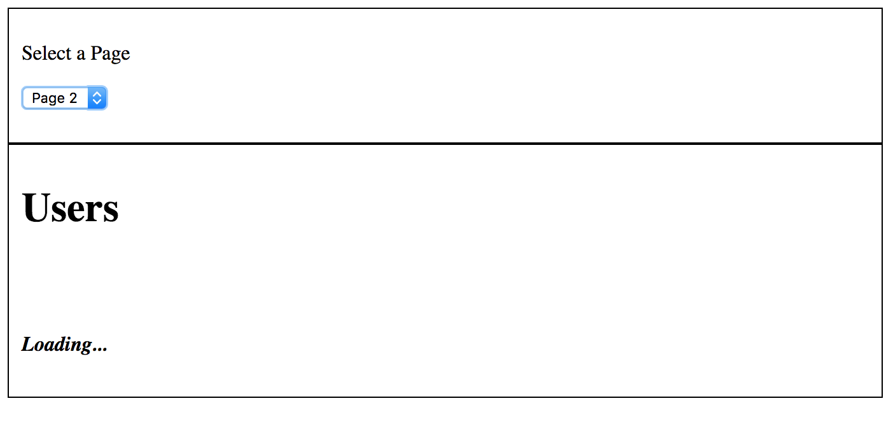
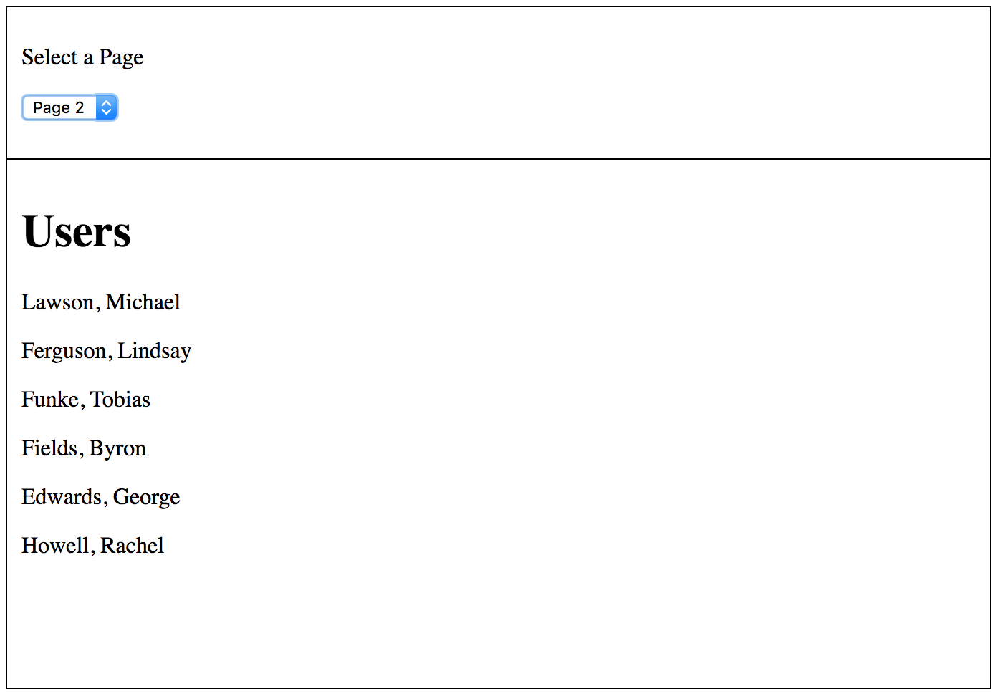

# HelloObservables

This projects shows how to use Observables in Angular and more importantly how to use Subjects to communicate between components.

The application fetches a simple users JSON from an open API and displays them in a component called DataContainer. Then there is another component (not a child or a parent) called Filter which has a simple drop down which allows the user to see Page 1 or Page 2 of the API data.

One requirement is that the user must be able to see some kind of a message while the data in being fetched (asynchronously) from the API.

## Initial load

## Selecting Page 2 - Display "Loading..."

## Display Page 2 contents

# To run this project

- Clone this project
- Go to the root
- Type **npm install**
- Once the node modules are installed, run **ng serve --open**
